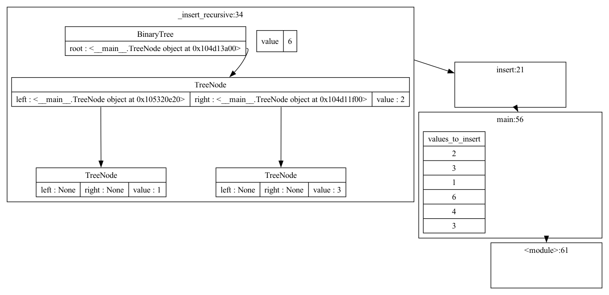

# Simple Python State Visualizer

## Overview

The `Visualizer` class provides a powerful way to visualize Python objects, including their attributes and relationships, in a graphical format using the Graphviz DOT language. It handles various data types, including primitives, lists, dictionaries, and custom objects, allowing for a clear understanding of complex data structures.


## Installation

To use the `Visualizer`, ensure you have the following dependencies installed:

```bash
pip install pydot
```

You may also need Graphviz installed on your system to render the graphs. You can download it from [Graphviz's official site](https://graphviz.gitlab.io/download/).

## Usage

At the beginning your toy code, add 

```py
from visualizer import *
```

If you want it to trace at each step, using `trace function` is a good idea. For example, adding 

```py
# Trace function, call visualizer to inspect state
def trace_func(frame, event, arg):
    # avoid drawing too many states, only up to main function.
    # SURPRISE: The visualizer can visualize itself upon setting
    # valid_frames_frm to 0. (but the output will be really verbose).
    Visualizer().visualize_whole_state(valid_frames_frm=2, strict=True).write_png("test.png")
    input() # Pause the execution step
    return trace_func  
```

Or you may use `Visualizer().visualize_whole_state(valid_frames_frm=2, strict=True).write_png("test.png")` when a point of interest appears. 

